```mermaid
sequenceDiagram
    participant Navegador
    participant Servidor

    Navegador->>Servidor: HTTP POST /new_note
    Servidor-->>Navegador: HTTP 302 Found (Location: /notes)

    Navegador->>Servidor: HTTP GET /notes
    Servidor-->>Navegador: Página de Notas (HTML)

    Navegador->>Servidor: HTTP GET /main.css
    Servidor-->>Navegador: Hoja de estilo (CSS)

    Navegador->>Servidor: HTTP GET /main.js
    Servidor-->>Navegador: Código JavaScript

    Navegador->>Servidor: HTTP GET /data.json
    Servidor-->>Navegador: Datos de Notas (JSON)
```

```
sequenceDiagram
    participant Navegador
    participant Servidor

    Navegador->>Servidor: HTTP POST /new_note
    Servidor-->>Navegador: HTTP 302 Found (Location: /notes)

    Navegador->>Servidor: HTTP GET /notes
    Servidor-->>Navegador: Página de Notas (HTML)

    Navegador->>Servidor: HTTP GET /main.css
    Servidor-->>Navegador: Hoja de estilo (CSS)

    Navegador->>Servidor: HTTP GET /main.js
    Servidor-->>Navegador: Código JavaScript

    Navegador->>Servidor: HTTP GET /data.json
    Servidor-->>Navegador: Datos de Notas (JSON)
```



