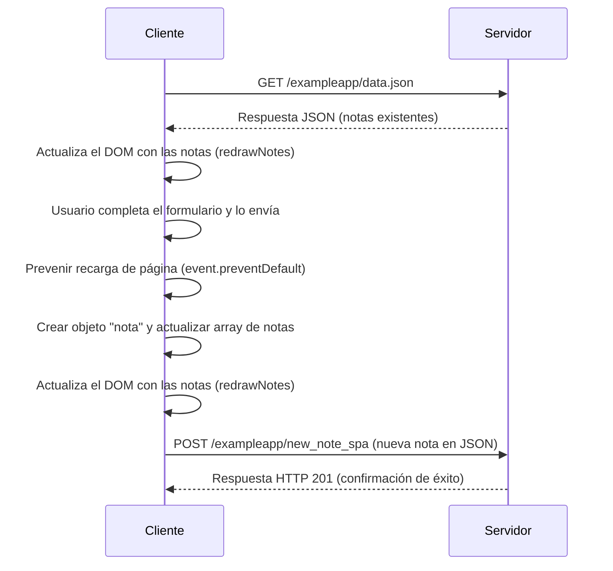

```
sequenceDiagram
    participant Cliente
    participant Servidor

    Cliente->>Servidor: GET /exampleapp/data.json
    Servidor-->>Cliente: Respuesta JSON (notas existentes)
    Cliente->>Cliente: Actualiza el DOM con las notas (redrawNotes)

    Cliente->>Cliente: Usuario completa el formulario y lo envía
    Cliente->>Cliente: Prevenir recarga de página (event.preventDefault)
    Cliente->>Cliente: Crear objeto "nota" y actualizar array de notas
    Cliente->>Cliente: Actualiza el DOM con las notas (redrawNotes)

    Cliente->>Servidor: POST /exampleapp/new_note_spa (nueva nota en JSON)
    Servidor-->>Cliente: Respuesta HTTP 201 (confirmación de éxito)
```

