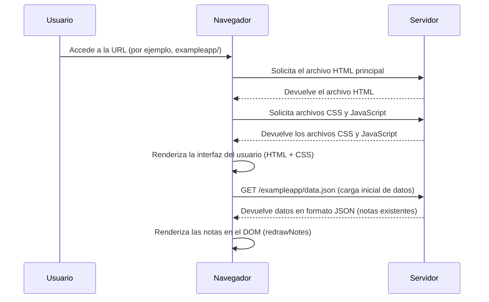

```
sequenceDiagram
    participant Usuario
    participant Navegador
    participant Servidor

    Usuario->>Navegador: Accede a la URL (por ejemplo, exampleapp/)
    Navegador->>Servidor: Solicita el archivo HTML principal
    Servidor-->>Navegador: Devuelve el archivo HTML
    Navegador->>Servidor: Solicita archivos CSS y JavaScript
    Servidor-->>Navegador: Devuelve los archivos CSS y JavaScript
    Navegador->>Navegador: Renderiza la interfaz del usuario (HTML + CSS)

    Navegador->>Servidor: GET /exampleapp/data.json (carga inicial de datos)
    Servidor-->>Navegador: Devuelve datos en formato JSON (notas existentes)
    Navegador->>Navegador: Renderiza las notas en el DOM (redrawNotes)
```

